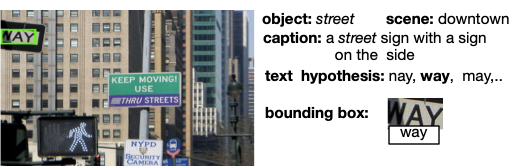
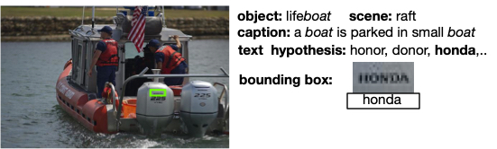
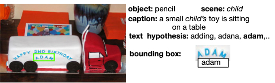

# Baseline 
BERT (fine-tune)
## Requirements
- Python 2.7
- Tensorflow 1.15.0

## Install 
```
conda create -n BERT_visual python=2.7 anaconda
conda activate BERT_visual
pip install tensorflow==1.15.0
```
## train + inference 
```
train_model.py
```
## Demo
At inference time, BERT also can take multiple visual contexts at once. 



One viual context (caption)
<pre>
<b>w2</b> 0.08594558 way a street sign with a sign on the side 
w3 0.001697046 nay a street sign with a sign on the side 
w1 0.004531573 may a street sign with a sign on the side 
</pre>


Two visual context (object,caption) 
<pre> 
<b>w2</b> 0.9781983	way street a street sign with a sign on the side 
w3 0.26434046 may street  a street sign with a sign on the side
w1 0.016956575 nay street a street sign with a sign on the side 
</pre>

Three visual context (object, place, caption) 
<pre>
<b>w2</b>  0.9992834 way  street downtown	a street sign with a sign on the side 
w3 0.97025 nay  street downtown	a street sign with a sign on the side 
w1 0.99600935 may  street downtown a street sign with a sign on the side
</pre>




one viual context 
<pre>
<b>w5</b> 0.19189669 honda,a boat is parked in small boat      
w3 0.002314983 honor a boat is parked in small boat    
w1 0.0017780885 donor a boat is parked in small boat  
</pre>


Two visual context (object, place, caption)

<pre>
<b>w5</b>  0.05679198	honda lifeboat, a boat is parked in small boat    
0.004719834  honor lifeboat	a boat is parked in small boat 
0.0038314406  donor lifeboat a boat is parked in small boat  
</pre>

Three visual context 

<pre>
<b>w5</b> 0.8987089 honda lifeboat raft a boat is parked in small boat    
w3 0.05099003 honor lifeboat raft a boat is parked in small boat  
w1  0.019986507  donor lifeboat raft a boat is parked in small boat  
</pre>

  


<pre>
<b>w3</b> 0.0028061015  adam	a small child's toy is sitting on  a table 
w2 0018062529 adana	a small child's toy is sitting on  a table
w1 0.0022634089 adding	a small child's toy is sitting on  a table 
</pre>

Two visual context (object, caption)

<pre>
w1 0.012818227 adding child	a small child's toy is sitting on  a table 
<b>w3</b> 0.009032666 adam child	a small child's toy is sitting on  a table 
</pre>

However, in some cases multiple visual context can lead to wrong re-ranking.  


Note that, for best result, the baseline softmax score is needed to be * with this score and then re-ranked again.

Download the [pretrained model](https://www.dropbox.com/s/1fuuch3shhld4hw/pre-trained-mode-1epoch.zip?dl=0) 


