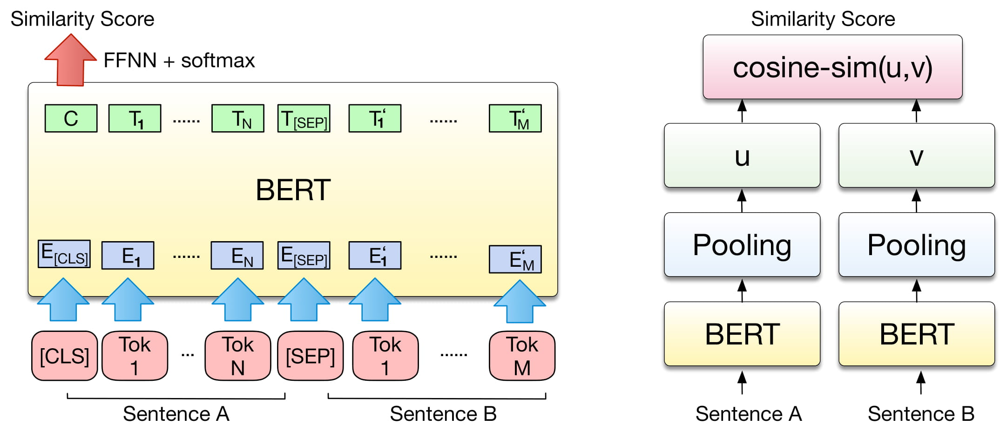

## Visual Semantic Relatedness with BERT 
According to BERT authors, _BERT embedding_ it is not suited for  Semantic  Textual  Similarity  (STS) task directly, since  it  does not generate a meaningful vector to compute the cosine distance. There are two uses of BERT to compute the Semantic similiatiy: **(1)** fine-tuning (Left) **(2)** pooling or averging (Right)





For the first *left* approach, we need to fine-tune BERT first on the training dataset  [(see here)](BERT_semantic_related/)  
Then after having all files + ``BERT_score``

```
 python BERT-visual.py --ulm LM.txt --bl baseline.txt --text spotted-text.txt --vis visual-context_label.txt --vis_prob visual-context_prob.txt
``` 
with all these flags

- ``--ulm``  LM.txt   
- ``--bl``  baseline.txt
-  ``--text``  spotted-text.txt
-  ``--vis``  visual-context_label.txt 
-  ``--vis_prob``  visual-context_prob.txt
-  ``-- sim`` BERT_score computed [similairty score with fine-tuned BERT](BERT_semantic_related/) 


For the second approach *right* we will use general-purpose SBERT with cosine similairy [Sentence BERT](https://github.com/UKPLab/sentence-transformers)  

```
conda create -n SBERT python=3.7 anaconda
conda activate SBERT
pip install sentence-transformers
``` 


## Example 1


-->


```
python quarters-example/python BERT-visual.py --ulm LM.txt --bl baseline.txt --text spotted-text.txt --vis visual-context_label.txt --vis_prob visual-context_prob.txt
```


After visual re-ranking 
``` 
quarters 7.040899415659617e-06
quotas   4.0903987856408736e-07
quartos  2.0644119047556385e-09
``` 


## Example 2

-->


```
stock-example/python BERT-visual.py --ulm LM.txt --bl baseline.txt --text spotted-text.txt --vis visual-context_label.txt --vis_prob visual-context_prob.txt
```

After visual re-ranking 
``` 
stock 0.00018136249963338343
sioux 3.1327470941288846e-06
stook 8.07711670696e-07
``` 

## Citation

Please use the following bibtex entry:
```bibtex
@inproceedings{sabir2020textual,
  title={Textual visual semantic dataset for text spotting},
  author={Sabir, Ahmed and Moreno-Noguer, Francesc and Padr{\'o}, Llu{\'\i}s},
  booktitle={Proceedings of the IEEE/CVF Conference on Computer Vision and Pattern Recognition Workshops},
  pages={542--543},
  year={2020}
}

```

