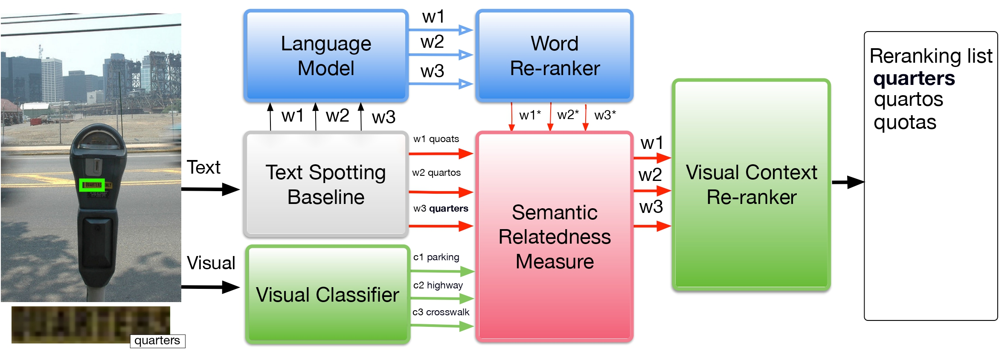

#  Semantic Relatedness with Word Embedding (SWE)

Implementation of the paper [Visual Re-ranking with Natural Language
Understanding for Text Spotting](https://arxiv.org/pdf/1810.12738.pdf). sabir et al. ACCV 2018.



 ## Model 
 
 <!--ts-->
   * Count-based word embedding visual re-ranker  
   * [Knowleage-based word embedding  visual re-ranker](https://github.com/sabirdvd/visual-re-ranker-with-w2v/tree/main/knowledge-base-embedding)
   * [Contextual-based embedding BERT visual re-ranker](https://github.com/sabirdvd/visual-re-ranker-with-w2v/tree/main/BERT-based)
<!--te-->

## Introduction 
Many scene text recognition approaches are based on purely visual information and ignore the semantic relation between scene andtext. In this paper, we tackle this problem from natural language processing perspective to fill the gap between language and vision. We propose apost-processing approach to improve scene text recognition accuracy byusing occurrence probabilities of words (unigram language model), and the  semantic  correlation  between  scene  and  text.  For  this,  we  initiallyrely on an off-the-shelf deep neural network, already trained with large amount  of  data,  which  provides  a  series  of  text  hypotheses  per  inputimage. These hypotheses are then re-ranked using word frequencies and semantic  relatedness  with  objects  or  scenes  in  the  image.  As  a  result of this combination, the performance of the original network is boostedwith almost no additional cost. We validate our approach on ICDAR’17dataset

 
## Count-based word embedding visual re-ranker 
 
 
### Requirement  
```
conda create -n Visual_w2v python=3.8 anaconda
conda activate Visual_w2v
pip install gensim==4.1.0
```


## Data

Install GloVe [pre-trained word vectors  glove.6B.300d.txt](https://nlp.stanford.edu/projects/glove/)
bigger is better, the 840B pre-trained word vectors is recommneded. We use [Glove](https://nlp.stanford.edu/pubs/glove.pdf) as main in this work. The advantage of Glove over Word2Vec is that it  does  not  rely  on  local  word-context  information,  but  it incorporates global co-occurrence statistics.

For w2v install [GoogleNews-vectors-negative300.bin](https://github.com/mmihaltz/word2vec-GoogleNews-vectors)

For [fastext](https://arxiv.org/pdf/1607.04606.pdf) install [crawl-300d-2M.vec](crawl-300d-2M-subword.zip)

## How to run 
To be able to use w2v/Glove as visual re-ranker, we need the following information 


- The spotted text `text_spotted.txt`: word candidates from the baseline  
- The original hypothesis from the baseline ``baseline.txt`` softmax output 
- The hypothesis `LM.txt`: initialized by common observation (ie [LM](https://github.com/sabirdvd/visual-re-ranker-with-w2v/tree/main/ULM))
- Visual information from the image `visual-context_label.txt`: initialized visual context or classifer confident 
- Visual information  confidence `visual-context_prob.txt` from the classifier -ie RseNet152


After having all the required information ``run``  as shown in **Example 1** (below) 

For GloVe
```
quarters-example/python glove-visual.py --ulm LM.txt --bl baseline.txt --text spotted-text.txt --vis visual-context_label.txt --vis_prob visual-context_prob.txt
```

For w2v 

```
quarters-example/python w2v-visual.py --ulm LM.txt --bl baseline.txt --text spotted-text.txt --vis visual-context_label.txt --vis_prob visual-context_prob.txt
``` 

For fasttext 

```
quarters-example/python fastext-visual.py --ulm LM.txt --bl baseline.txt --text spotted-text.txt --vis visual-context_label.txt --vis_prob visual-context_prob.txt
``` 

## Example 1


-->


Orignial baseline softmax score
``` 
quartos  0.060192
quotas   0.040944	
quarters 0.03037
``` 

After visual re-ranking  `` visual_glove_result.txt ``  
``` 
quarters 7.040899415659617e-06
quotas   4.0903987856408736e-07
quartos  2.0644119047556385e-09
``` 


## Example 2

-->


Orignial baseline softmax score
``` 
stook 0.4865732956	
sioux 0.0919743552	
stock 0.0703927792
``` 
After visual re-ranking `` visual_glove_result.txt ``   
``` 
stock 0.00018136249963338343
sioux 7.23838175424e-06
stook 8.07711670696e-07
``` 

## Citation

Please use the following bibtex entry:
```bibtex
@inproceedings{sabir2018visual,
  title={Visual re-ranking with natural language understanding for text spotting},
  author={Sabir, Ahmed and Moreno-Noguer, Francesc and Padr{\'o}, Llu{\'\i}s},
  booktitle={Asian Conference on Computer Vision},
  pages={68--82},
  year={2018},
  organization={Springer}
}
```
